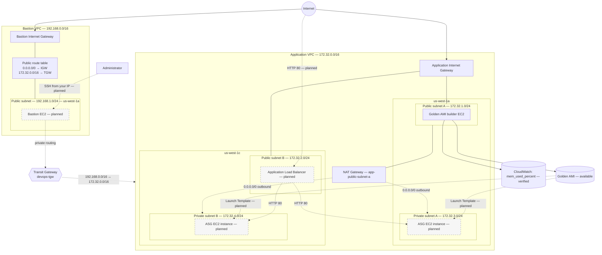

# Project 02 — Scalable AWS VPC Architecture

**Legend:** Solid nodes = provisioned/configured; dashed nodes = planned/not yet deployed. The builder instance and Golden AMI are prepared, but the application fleet is not deployed yet.

## Implementation notes

- Both Transit Gateway VPC attachments and TGW route propagation have been verified.
- Both application private subnets currently share **one zonal NAT Gateway in us-west-1a**. This is not fully AZ-resilient and may incur cross-AZ data transfer charges.
- The Application Load Balancer will be associated with **both public subnets**, even though its diagram node is drawn in one for legibility.
- App Security Group allows HTTP from the ALB Security Group; SSH from the bastion's private IP is to be added after the bastion is deployed.
- VPC Flow Logs, S3 configuration bucket, bastion EC2, launch template, ASG, ALB, and Route 53 are still pending.
- The Golden AMI contains software and agent configuration, not the IAM instance role or security groups.
